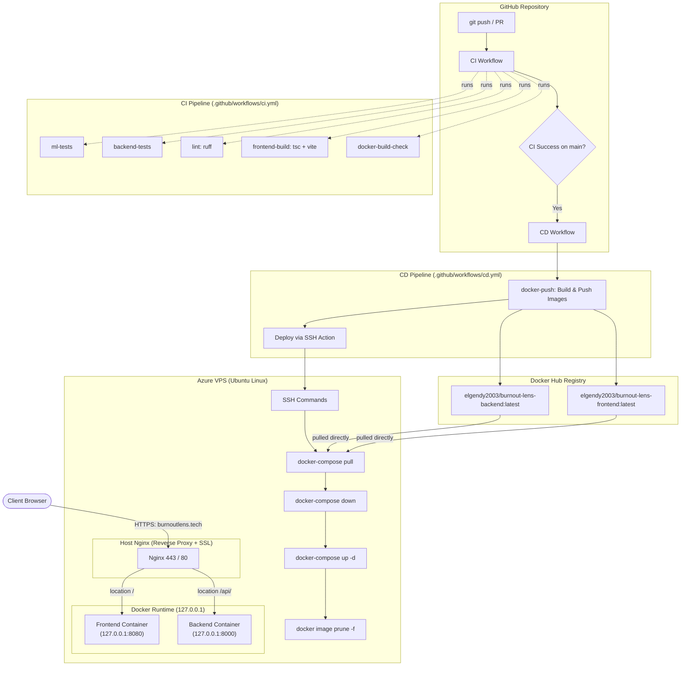

# BurnOut Lens

> Predict employee burnout risk (0–10) with Explainable AI (SHAP).

[](https://github.com/mahmoud375/BurnOut-Lens/actions/workflows/ci.yml)
[](https://github.com/mahmoud375/BurnOut-Lens/actions/workflows/cd.yml)
[](https://burnoutlens.tech)
[](https://www.python.org/downloads/release/python-3120/)
[](https://react.dev/)

---

## Overview

Burnout in tech and knowledge work is often detected only after severe physical or mental exhaustion has set in. Traditional assessments rely on vague, subjective questionnaires that output an arbitrary score without actionable context.

**BurnOut Lens** replaces guesswork with an objective machine learning model that predicts an employee's burnout risk on a continuous **0.0 to 10.0** scale, mapped across 4 severity tiers (**Low**, **Moderate**, **High**, **Severe**). Crucially, the system does not stop at a black-box number: it integrates **SHAP (SHapley Additive exPlanations)** to break down exactly which work habits, pressures, or protective factors contributed positively or negatively to the final assessment.

---

## Live Demo

* **Web Application**: [https://burnoutlens.tech](https://burnoutlens.tech)

---

## How It Works

### The Prediction
The model accepts 9 workplace and lifestyle factors and evaluates them against patterns learned from 100,000 tech worker profiles:

1. **Seniority Level**: `Junior`, `Mid`, `Senior`, `Lead`, `Manager`, or `Principal`.
2. **Weekly Work Hours**: Hours worked per week (bounded between `20.0` and `90.0`).
3. **Meetings Per Day**: Average daily meetings (bounded between `0.0` and `15.0`).
4. **Sleep Per Night**: Average sleep duration in hours (bounded between `2.0` and `12.0`).
5. **Exercise Days**: Workout frequency in days per week (bounded between `0.0` and `7.0`).
6. **Vacation Days Taken**: Annual vacation days utilized (bounded between `0.0` and `30.0`).
7. **Social Support Score**: Perceived colleague/friend support on a scale of `1.0` to `10.0`.
8. **Manager Support Score**: Perceived direct manager support on a scale of `1.0` to `10.0`.
9. **Deadline Pressure Score**: Perceived timeline and delivery pressure on a scale of `1.0` to `10.0`.

The API returns:
* **`burnout_score`**: The predicted score clipped to `[0.0, 10.0]`.
* **`burnout_level`**: A clear human-readable severity label (`Low`, `Moderate`, `High`, `Severe`).
* **`base_value`**: The dataset-wide average prediction baseline (~5.40).
* **`contributions`**: An ordered list ranking all 9 features by their absolute impact on the score.

### The Explainability Angle (SHAP)
Traditional machine learning outputs a single opaque metric. A score of `7.4` tells an engineer they are at high risk, but provides zero insight into *why*.

BurnOut Lens uses **SHAP** to attribute credit or blame to every input feature:
* **Positive contributions (`increases`)**: Push the score higher toward burnout (e.g. `+0.85` from working 52 hours/week, `+0.62` from high deadline pressure).
* **Negative contributions (`decreases`)**: Act as protective buffers pulling the score lower (e.g. `-0.54` from 8 hours of sleep, `-0.38` from strong manager support).

By transforming abstract model weights into tangible individual impacts, users and teams can immediately identify which specific lifestyle changes or workplace adjustments will most effectively mitigate their burnout risk.

---

## Tech Stack

| Layer | Technology | Version | Purpose |
| :--- | :--- | :--- | :--- |
| **Frontend** | React | `19.2.8` | Component-driven user interface |
| | Vite | `8.3.0` | Development server and static asset bundler |
| | TypeScript | `~6.0.2` | Static typing and API contract enforcement |
| | Oxlint | `^1.81.0` | Fast JavaScript/TypeScript linting |
| | Nginx | `1.27-alpine` | Production static asset container server |
| **Backend** | FastAPI | `>=0.115.0` | High-performance asynchronous REST API framework |
| | Uvicorn | `>=0.32.0` | ASGI production application server |
| | Python | `3.12` | Core backend runtime |
| | Pydantic | `>=2.10.0` | Request validation and response serialization |
| | Pydantic Settings | `>=2.7.0` | Environment variable management |
| | uv | `0.12.0` | Ultra-fast Python package and venv manager |
| **ML & Explainability** | XGBoost | `3.4.1` (`xgboost-cpu`) | Gradient-boosted regression model |
| | SHAP | `>=0.47.2` | TreeExplainer for exact Shapley feature attribution |
| | scikit-learn | `>=1.9.1` | Train/test splitting and evaluation metrics |
| | pandas | `>=3.0.5` | Tabular data manipulation |
| | pyarrow | `>=18.0` | High-performance columnar dataset processing |
| **Infra & DevOps** | Docker | Engine & Compose | Multi-container isolation and packaging |
| | GitHub Actions | CI & CD | Automated testing, linting, image builds, and deployment |
| | Docker Hub | Registry | Public container image storage |
| | Host Nginx | Reverse Proxy | SSL/TLS termination and reverse-proxy routing on VPS |
| | Let's Encrypt | Certbot | Automated HTTPS certificates |
| | Azure VPS | Ubuntu Linux | Cloud hosting infrastructure |

---

## Machine Learning

### Model & Hyperparameters
* **Algorithm**: `XGBRegressor` from XGBoost, utilizing histogram-based tree splitting (`tree_method: "hist"`).
* **Dataset**: `mental_health_burnout_tech_2026.csv` containing **100,000 synthetic tech worker records**.
* **Split Strategy**: 80% training set (80,000 records) and 20% held-out test set (20,000 records), evaluated with a fixed random seed (`42`).
* **Selected Hyperparameters**:
  ```python
  {
      "n_estimators": 300,
      "max_depth": 5,
      "learning_rate": 0.05,
      "subsample": 0.8,
      "colsample_bytree": 0.8,
      "tree_method": "hist",
      "random_state": 42
  }
  ```

### Performance Metrics (Held-Out Test Set)
Evaluated on the 20,000 test observations:
* **Coefficient of Determination ($R^2$)**: **`0.6987`** (~70% of burnout score variance explained)
* **Mean Absolute Error (MAE)**: **`1.1641`** points on the 10-point scale
* **Root Mean Squared Error (RMSE)**: **`1.4619`** points

### Explainability Engine
* Uses `shap.TreeExplainer` applied directly to the trained `XGBRegressor`.
* TreeExplainer computes mathematically exact Shapley values directly through tree traversal without relying on sampling approximations.
* The model artifact (`xgb_burnout_model.json`, ~1.08 MB) and the SHAP explainer are loaded once at application startup as a module-level singleton in `backend/app/core/model_loader.py` (load times: model ~110ms, explainer ~88ms). Incoming prediction requests incur zero model reloading overhead.

### Backend Packaging
The ML code in `ml/` is structured as a standard Python package (`burnout-lens`). In development and Docker environments, `ml/` is mounted and installed as an editable local dependency (`burnout-lens = { path = "../ml", editable = true }`). This ensures that training definitions, feature bounds, ordinal encoders, and inference logic share a single source of truth without duplication.

---

## API Reference

### Endpoints

| Method | Endpoint | Description | Auth |
| :--- | :--- | :--- | :--- |
| `GET` | `/health` | Service liveness check and model readiness verification | None |
| `POST` | `/predict` | Primary prediction and SHAP explanation endpoint | None |
| `GET` | `/` | Redirects bare root to interactive Swagger UI documentation | None |
| `GET` | `/docs` | OpenAPI Swagger UI explorer | None |
| `GET` | `/redoc` | Interactive ReDoc documentation | None |
| `GET` | `/openapi.json` | Raw OpenAPI 3.1 JSON schema specification | None |

### `POST /predict` Example

#### Request (`POST /predict` or `POST /api/predict`)
```json
{
  "seniority_level": "Senior",
  "work_hours_per_week": 48.0,
  "meetings_per_day": 5.0,
  "sleep_hours_per_night": 6.5,
  "exercise_days_per_week": 2.0,
  "vacation_days_taken": 8.0,
  "social_support_score": 6.0,
  "manager_support_score": 7.0,
  "deadline_pressure_score": 7.5
}
```

#### Response (`200 OK`)
```json
{
  "burnout_score": 6.82,
  "burnout_level": "High",
  "base_value": 5.40,
  "contributions": [
    {
      "feature": "deadline_pressure_score",
      "value": 7.5,
      "shap_value": 0.84,
      "direction": "increases"
    },
    {
      "feature": "work_hours_per_week",
      "value": 48.0,
      "shap_value": 0.65,
      "direction": "increases"
    },
    {
      "feature": "vacation_days_taken",
      "value": 8.0,
      "shap_value": -0.42,
      "direction": "decreases"
    },
    {
      "feature": "manager_support_score",
      "value": 7.0,
      "shap_value": -0.31,
      "direction": "decreases"
    },
    {
      "feature": "meetings_per_day",
      "value": 5.0,
      "shap_value": 0.28,
      "direction": "increases"
    },
    {
      "feature": "sleep_hours_per_night",
      "value": 6.5,
      "shap_value": -0.22,
      "direction": "decreases"
    },
    {
      "feature": "social_support_score",
      "value": 6.0,
      "shap_value": -0.18,
      "direction": "decreases"
    },
    {
      "feature": "exercise_days_per_week",
      "value": 2.0,
      "shap_value": -0.12,
      "direction": "decreases"
    },
    {
      "feature": "seniority_level",
      "value": 2.0,
      "shap_value": 0.08,
      "direction": "increases"
    }
  ]
}
```

---

## Architecture & Deployment

### Deployment Pipeline Overview



### Continuous Integration (CI)
Defined in [`.github/workflows/ci.yml`](.github/workflows/ci.yml), running 5 parallel jobs on every push and pull request across all branches:
1. **`ml-tests`**: Sets up Python 3.12, installs `uv`, restores package cache, syncs dependencies, and runs all 128 ML unit and integration tests.
2. **`backend-tests`**: Resolves editable `ml/` dependencies alongside `backend/`, and runs all 55 FastAPI endpoint and service tests.
3. **`lint`**: Runs `ruff check` across `ml/src/`, `ml/tests/`, `backend/app/`, and `backend/tests/` to enforce code quality without auto-modifying files in CI.
4. **`frontend-build`**: Sets up Node.js 22, performs `npm ci`, runs TypeScript validation (`tsc -b`), and verifies the production build (`npm run build`).
5. **`docker-build-check`**: Validates that both `backend/Dockerfile` and `frontend/Dockerfile` build cleanly with Docker Buildx without publishing images.

### Continuous Deployment (CD)
Defined in [`.github/workflows/cd.yml`](.github/workflows/cd.yml), triggered automatically via `workflow_run` only when CI completes successfully on the `main` branch:
1. **`docker-push`**:
   * Logs into Docker Hub using encrypted repository secrets.
   * Compiles and publishes container images (linux/amd64) for both backend and frontend.
   * Tags each image with both `latest` and the immutable 7-character commit SHA (e.g. `:146c95a`).
   * The frontend is built with `--build-arg VITE_API_BASE_URL=/api` so all API requests are routed through the same-origin reverse proxy.
2. **`deploy`**:
   * Connects to the Azure VPS over SSH using a dedicated `deploy` service account key.
   * Executes redeployment in `/home/deploy` (a brief service interruption of a few seconds occurs while containers are stopped and recreated):
     ```bash
     docker-compose -f docker-compose.prod.yml pull
     docker-compose -f docker-compose.prod.yml down
     docker-compose -f docker-compose.prod.yml up -d
     docker image prune -f
     ```

### Host Nginx & HTTPS
* **Reverse Proxy**: Host Nginx listens on ports `80` and `443` for domain `burnoutlens.tech`.
* **Path Routing**:
  * Requests matching `location /api/` strip the `/api/` prefix and proxy pass to `http://127.0.0.1:8000/`.
  * All remaining requests matching `location /` proxy pass to the frontend container at `http://127.0.0.1:8080`.
* **Isolation**: Containers are strictly bound to `127.0.0.1` so ports `8000` and `8080` are never exposed directly to the public internet.
* **Certificates**: Managed automatically via Let's Encrypt and Certbot with HTTP-to-HTTPS redirect.

### Published Container Images
* **Backend**: [`elgendy2003/burnout-lens-backend`](https://hub.docker.com/r/elgendy2003/burnout-lens-backend)
* **Frontend**: [`elgendy2003/burnout-lens-frontend`](https://hub.docker.com/r/elgendy2003/burnout-lens-frontend)

---

## Configuration

The application uses standard environment variables and build arguments. All operational defaults work out of the box for local development.

| Variable | Scope | Type | Purpose | Default / Example |
| :--- | :--- | :--- | :--- | :--- |
| `CORS_ORIGINS` | Backend | Config | Comma-separated list of allowed browser origins | `http://localhost:5173,http://68.210.99.220,http://burnoutlens.tech,https://burnoutlens.tech` |
| `BURNOUT_MODEL_PATH` | Backend | Config | Filesystem path override for model JSON artifact | `ml/models/xgb_burnout_model.json` |
| `VITE_API_BASE_URL` | Frontend | Build Arg | Base URL for API requests baked into JS bundle | Local: `http://localhost:8000`<br>Prod: `/api` |
| `DOCKERHUB_USERNAME` | CI/CD | Secret | Docker Hub account username | `elgendy2003` |
| `DOCKERHUB_TOKEN` | CI/CD | Secret | Docker Hub Personal Access Token | `***` |
| `VPS_HOST` | CI/CD | Secret | Public IP or domain of deployment server | `burnoutlens.tech` |
| `VPS_USERNAME` | CI/CD | Secret | Dedicated SSH deployment user on VPS | `deploy` |
| `VPS_SSH_KEY` | CI/CD | Secret | Private SSH key for passwordless deploy user access | `***` |

---

## Getting Started Locally

### Prerequisites
* [Python 3.12+](https://www.python.org/downloads/)
* [`uv`](https://astral.sh/uv) package manager
* [Node.js 22+](https://nodejs.org/) & `npm`
* [Docker & Docker Compose](https://docs.docker.com/get-docker/) (optional, for containerized run)

### Option 1: Native Development (Fastest iteration)

1. **Start the Backend**:
   ```bash
   cd backend
   uv sync
   uv run uvicorn app.main:app --reload --port 8000
   ```
   *The API will be available at [http://localhost:8000](http://localhost:8000) (Swagger docs at [/docs](http://localhost:8000/docs)).*

2. **Start the Frontend** (in a separate terminal):
   ```bash
   cd frontend
   npm install
   npm run dev
   ```
   *The web application will launch at [http://localhost:5173](http://localhost:5173).*

---

### Option 2: Full-Stack Docker Compose

Run the entire stack locally with a single command:
```bash
docker compose up --build
```
* **Frontend**: [http://localhost](http://localhost) (port 80)
* **Backend**: [http://localhost:8000](http://localhost:8000)

---

### Option 3: Retraining & Evaluating the ML Model

To re-run the training pipeline from the raw dataset:
```bash
cd ml
uv sync

# Run data preprocessing and train XGBoost regressor
uv run python -m src.train

# Generate evaluation metrics and SHAP importance plots
uv run python -m src.evaluate
```
*Trained artifacts are written to `ml/models/xgb_burnout_model.json`, and metrics/plots are saved to `ml/reports/`.*

---

## Project Structure

```
BurnOut Lens/
├── .github/
│   └── workflows/
│       ├── ci.yml                 # CI: 5 parallel test/lint/build jobs
│       └── cd.yml                 # CD: Docker Hub publishing + SSH deploy to Azure VPS
├── backend/
│   ├── app/
│   │   ├── api/routes/            # API endpoints (/predict, /health)
│   │   ├── core/                  # Model & SHAP singleton loaders, configuration
│   │   ├── schemas/               # Pydantic schemas (BurnoutRequest, BurnoutResponse)
│   │   ├── services/              # Prediction and SHAP orchestration service
│   │   └── main.py                # FastAPI factory, CORS setup, root docs redirect
│   ├── tests/                     # 55 pytest tests covering endpoints & validation
│   ├── Dockerfile                 # Single-stage Python 3.12-slim container definition
│   └── pyproject.toml             # Backend dependencies and tool configurations
├── frontend/
│   ├── public/                    # Static web assets (favicon.svg)
│   ├── src/
│   │   ├── api/                   # API client (predict.ts) reading VITE_API_BASE_URL
│   │   ├── components/            # BurnoutForm.tsx and ResultPanel.tsx with SHAP bars
│   │   ├── types/                 # TypeScript interfaces for API payloads
│   │   ├── App.tsx                # Main single-page application component
│   │   └── main.tsx               # React application entrypoint
│   ├── nginx.conf                 # Production Nginx SPA fallback configuration
│   ├── Dockerfile                 # Multi-stage container (Node 22 build -> Nginx 1.27 serve)
│   └── package.json               # Frontend dependencies and npm scripts
├── ml/
│   ├── data/                      # Raw dataset (100k rows) and processed parquet splits
│   ├── models/                    # Serialized XGBoost model (xgb_burnout_model.json)
│   ├── reports/                   # Training metrics (metrics.json) & SHAP charts
│   ├── src/                       # Preprocessing, config, training, evaluation, XAI
│   ├── tests/                     # 128 pytest tests for feature bounds, logic, and models
│   └── pyproject.toml             # ML package metadata (installable as burnout-lens)
├── docker-compose.yml             # Local development compose definition
├── docker-compose.prod.yml        # Production compose spec utilizing Docker Hub images
└── README.md                      # Project documentation
```

---

## Testing

The project maintains comprehensive test coverage across both the machine learning pipeline and the FastAPI backend service.

### Running ML Tests (128 Tests)
Verifies feature bounds, ordinal mappings, outlier clipping, model serializability, and SHAP attribution calculations:
```bash
cd ml
uv run pytest -v
```

### Running Backend Tests (55 Tests)
Verifies endpoint status codes, Pydantic field validations, 422 error handlers, Swagger UI redirects, and model loader integration:
```bash
cd backend
uv run pytest -v
```

### Running Code Quality Linters
```bash
uv tool run ruff check ml/src/ ml/tests/
uv tool run ruff check backend/app/ backend/tests/
```

---

## License

This project is licensed under the [MIT License](LICENSE).
